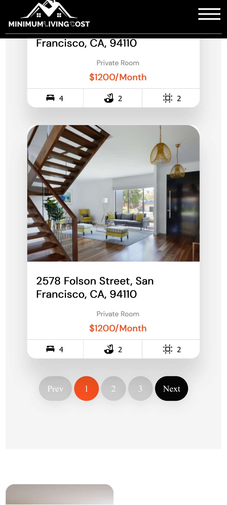

# Home_Rental_Services-Landing page challenge
 A Landing page challenge.

 This is a fully responsive web landing page for a Home rental company.

## Mobile view

## Desktop view

## My Process
### Built with

- Semantic HTML5 markup
- Mobile first design
- CSS custom properties
- Basic javasript
- jQuery

## Deploying
This project was deployed with
- [Netlify](https://www.netlify.com/)

# Links
- [Live site](https://minimumcost-cypha.netlify.app/)

## Authors
### Code by:
- Github - [@OmarCypha700](https://github.com/OmarCypha700)
- Frontend Mentor - [@OmarCypha700](https://www.frontendmentor.io/profile/yourusername)
- Twitter - [@OmarCypha](https://www.twitter.com/OmarCypha)
- E-mail - omarcypha@gmail.com

### Challenge by:
- Twitter - [@codingossy](https://twitter.com/codingossy)